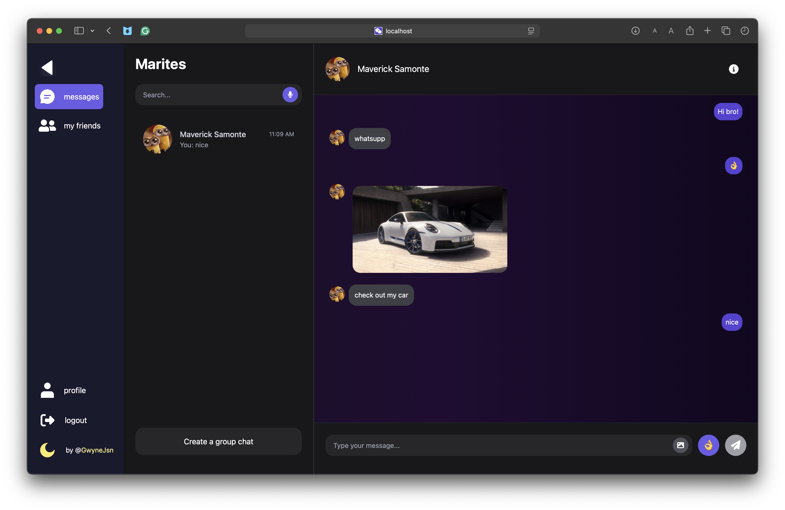

# Marites

**Marites** is a simple messaging app built with Angular. Designed for **real-time conversations**, **media sharing**, and **group chats**, it features full **dark mode support**, responsive mobile design, and uses **Firebase**.

---

## Live website

https://marites-277f8.web.app

---

## Preview



---

## Features

- **Real-Time Chat** – Instant message updates using Firebase
- ️**Media Sharing** – Seamless image upload & display
- **Private & Group Chats** – Switch between 1-on-1 and group messaging
- **Dark Mode Toggle** – One click to switch light/dark UI themes
- **Responsive Design** – Looks great on both mobile and desktop
- **Custom UI Elements** – Built from scratch with Tailwind

This project was generated using [Angular CLI](https://github.com/angular/angular-cli) version 19.2.8.

## Development server

To start a local development server, run:

```bash
ng serve
```

Once the server is running, open your browser and navigate to `http://localhost:4200/`. The application will automatically reload whenever you modify any of the source files.

## Code scaffolding

Angular CLI includes powerful code scaffolding tools. To generate a new component, run:

```bash
ng generate component component-name
```

For a complete list of available schematics (such as `components`, `directives`, or `pipes`), run:

```bash
ng generate --help
```

## Building

To build the project run:

```bash
ng build
```

This will compile your project and store the build artifacts in the `dist/` directory. By default, the production build optimizes your application for performance and speed.

## Running unit tests

To execute unit tests with the [Karma](https://karma-runner.github.io) test runner, use the following command:

```bash
ng test
```

## Running end-to-end tests

For end-to-end (e2e) testing, run:

```bash
ng e2e
```

Angular CLI does not come with an end-to-end testing framework by default. You can choose one that suits your needs.

## Additional Resources

For more information on using the Angular CLI, including detailed command references, visit the [Angular CLI Overview and Command Reference](https://angular.dev/tools/cli) page.

```

```
